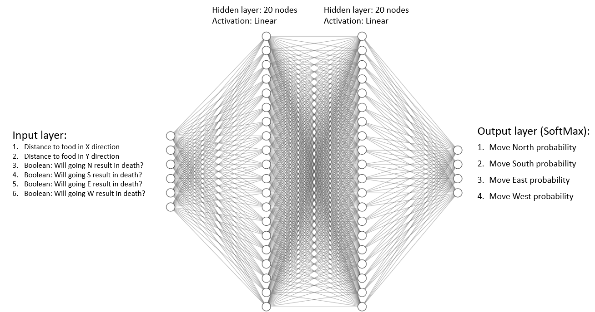

# SNAKE AI - FINAL PROJECT 
> Institution: Whitworth 2022 Spring  
> Course: CS457 - Artificial Intelligence  
> Instructor: Dr. Qian Mao   
> Date: 5/10/2022  
> Students: Zachary Bowyer and Jonathan Olderr  

# Install/run instructions
> install git  
> git clone https://github.com/ZachBowyer/SnakeAI.git  
> pip install pygame    
> pip install tensorflow    
> python main.py

# High level

For this program, we implemented an AI that could play the game snake.

## Description of the game
> Snake is a video game that originated during the late 1970s in arcades becoming
> something of a classic. It became the standard pre-loaded game on Nokia phones in 1998.
> The player controls a long, thin creature,resembling a snake, which roams around on
> a bordered plane, picking up food (or some other item), trying to avoid hitting its own tail
> or the edges of the playing area. Each time the snake eats a piece of food, its tail grows
> longer, making the game increasingly difficult. The user controls the direction of
> the snake's head (up, down, left, or right), and the snake's body follows.

## Implementation of the game
> For this project, we used and modified source code written by Rajat Dipta Biswas - https://github.com/rajatdiptabiswas/snake-pygame
> We modifed the game to allow either humans or bots to play it  
> We also altered how the score was handled

## AI Components
> ### Neural network
>> For this project, we tried many different neural network architectures  
>> Most of them were variants of an input layer, two hidden layers of 10-50 nodes, and an output layer of 4 nodes 
>>
>> Our most successful network was: 
>> > 
>> Graph made with: http://alexlenail.me/NN-SVG/index.html  
> 
> ### Genetic algorithm  
>> Since we have no datasets to train the neural network on, we used a genetic algorithm to adjust the weights and biases of our neural network.      
>> Population of 100 individuals, where each individual had its own neural network (Weights/biases)  
>> Each individual would play a game of snake, and sorted on a fitness function  
>> The individuals with the lowest fitness scores were deleted  
>> The remaining were made parents, and asexually created copies of themselves, called children  
>> These children randomly mutated their weights and biases
>> This process was repeated until we were satisfied with the results  
>>
> ### Fitness function
>> Eating a food adds a score of 1
>> Moving towards food adds a score of 0.01
>> Moving away from food subtracts a score of 0.001

## Results
> Insert video here?  
> Our best snake was able to get a score of 57  
> Average fitness of generation up to 23  

## Further work
> Have one central neural network in main.py, this will make code way more efficient  
> Explore the use of the NEAT algorithm in playing snake  
> Come up with a better fitness function  
> Improve file saving scheme, possibly automate it depending on architecture settings  
> Explore changing the fitness function as the snake grows  
> Try other neural network arcitectures   
> Implement sexual reproduction/crossover in the genetic algorithm  
> Experiment with larger/smaller population sizes and mutation rates  